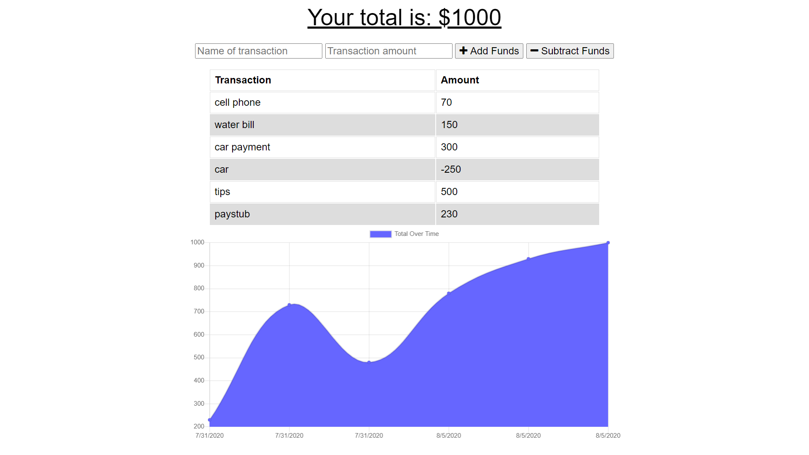

# Online/Offline Budget Tracker

## Description
As a developer I created a Online/Offline Budget tracker application, the app will allow users to add expenses and deposits to their budget with or without a connection. When users enter transactions offline, they should populate the total when brought back online. This application is target for avid travellers who wants to track withdrawals and deposits with or without a data/internet connection, therefore their account balance is accurate when they are traveling. Having offline functionality is paramount to our applications success.

## Offline Functionality
* Enter deposits offline

  * Enter expenses offline

When brought back online:

  * Offline entries should be added to tracker.

## Screenshot 


## Directory structure
```
.
├── models
│   └── transaction.js
|
├── node_modules
│ 
├── public
│    ├── icons
│    ├── images
│    ├── db.js
│    ├── index.html 
│    ├── index.js
│    ├── index.html
│    ├── manifest.webmanifest
│    ├── service-worker.js
│    └── styles.css
│
├── routes
│     └── api.js 
│
├── package.json
│
├── README.md
│
└── server.js    
```

## Links to deployed app
https://infinite-sands-63633.herokuapp.com/

https://eradicador.github.io/Progressive-Budget/.

## Badge


## License

MIT License

Copyright (c) [2020] [Michael Amaya]

Permission is hereby granted, free of charge, to any person obtaining a copy
of this software and associated documentation files (the "Software"), to deal
in the Software without restriction, including without limitation the rights
to use, copy, modify, merge, publish, distribute, sublicense, and/or sell
copies of the Software, and to permit persons to whom the Software is
furnished to do so, subject to the following conditions:

The above copyright notice and this permission notice shall be included in all
copies or substantial portions of the Software.

THE SOFTWARE IS PROVIDED "AS IS", WITHOUT WARRANTY OF ANY KIND, EXPRESS OR
IMPLIED, INCLUDING BUT NOT LIMITED TO THE WARRANTIES OF MERCHANTABILITY,
FITNESS FOR A PARTICULAR PURPOSE AND NONINFRINGEMENT. IN NO EVENT SHALL THE
AUTHORS OR COPYRIGHT HOLDERS BE LIABLE FOR ANY CLAIM, DAMAGES OR OTHER
LIABILITY, WHETHER IN AN ACTION OF CONTRACT, TORT OR OTHERWISE, ARISING FROM,
OUT OF OR IN CONNECTION WITH THE SOFTWARE OR THE USE OR OTHER DEALINGS IN THE
SOFTWARE.

## Contributing
[](code_of_conduct.md)